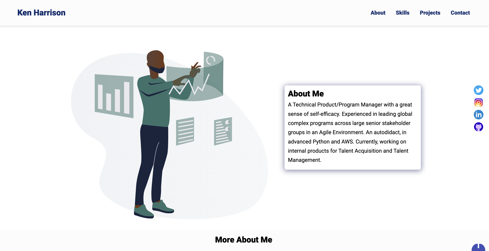

# Developer Portfolio

My portfolio website.

## Tech Stack

* HTML
* CSS
* JavaScript

## Tools Used

Below are are list of tools used, and the precise things they were used for:

* [Ion Icons](https://ionic.io/ionicons) for hambuger menu bar
* [Drawkit](https://undraw.co/) for main page illustration
* [Icon8](https://icons8.com/) for animated icons and skills icons
* [Animate CSS](https://animate.style/) for text animation
* [Formspree](https://formspree.io/) for contact form submision and straight delivery to Gmail
* [Color picker](https://imagecolorpicker.com/) to select the color palette for the page
